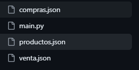

# PanCamp

El sistema fue hecho para prácticar git, en como subir un repositorio desde la terminal Para practicar lo visto en clase e ir avanzando exitosamente el curso de Git.

En este repositorio encontrarás 4 archivos con el fin de  implementar un sistema integral de gestión que permita manejar todas las operaciones relacionadas con la administración de productos, proveedores, empleados, clientes, así como la generación de informes relevantes para PanCamp.

Este programa cumple con:
* Agregar las ventas
* Agregar las compras
* Busqueda de ventas por fecha
* Información de compras

## Instalación
* Clona el repositorio: Utiliza el comando "git clone" seguido de la URL del repositorio para clonar el proyecto en tu computadora local.

* Abre la carpeta del proyecto: Navega a la carpeta donde se clonó el proyecto y ábrela en tu editor de código favorito.

* Abre el archivo main.py: Busca el archivo Python principal (usualmente "main.py") y ejecútalo en la terminal.
## Estructura
